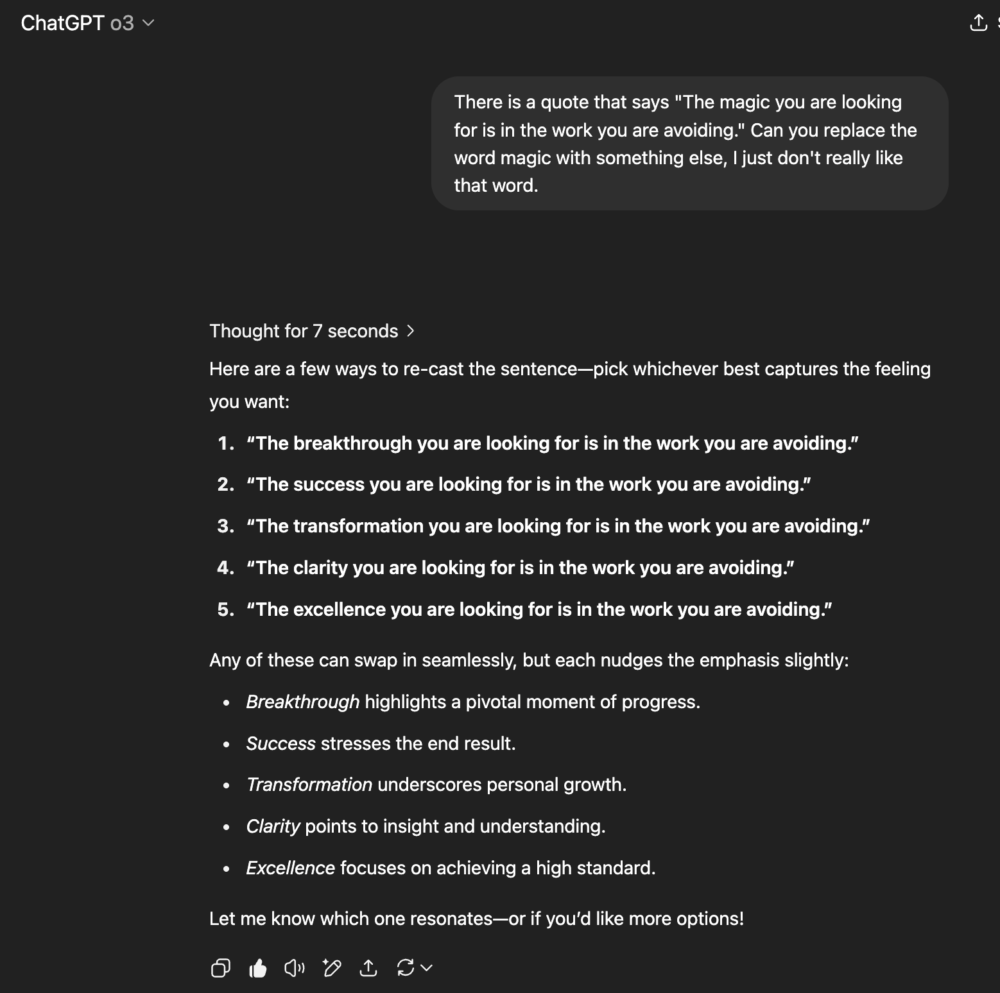
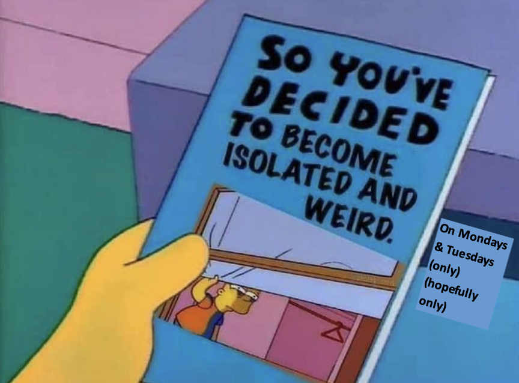
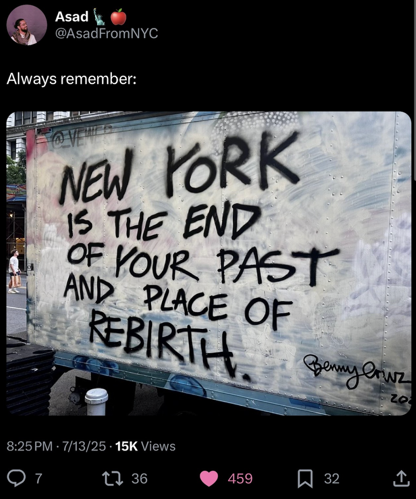

# 5WU7oGiwiao-stay

* because my dad told me to -- even if it takes 8 years or more?? i still have to listen to what he said, which is to come home with **that** job ... why ... bc my dad told me to
* succession -- greatest tv show ive ever experienced ever: 10/10 writing & acting, i would rewatch it but i dont like rewatching tv shows except for community bc the jokes are so funny
* there should have been more seasons of succession

 when i think of you, its always on my mind

-------------
* no scheduled seminars and no scheduled didactics in the summer, barely any meetings
* most scheduled meetings -> canceled
* nobody call me, txt me, im unavailable
* im not even getting my realid, i legit dont care, im not leaving nj and if i am its only to go to nyc, thats it

# RULES
* no posts from 9-5 work days
* BC im working
* no discussion of anything IP/internal/project specifics/code etc.
* note to self: things get out of hand on github after 10pm maybe just go to bed early

* unless something happens thats interesting?? like an earthquake?? i dunno ... funny?? like my dad thinking an email from m s k c c, bc i shared the screenshot of the email with him, about verifying my home address to recieve a staff appreciation gift, sent at like 4 am, which i clicked on lol ... is a phishing email ... and then me saying ... noooo its not ... phishing, it cant be (cuz i clicked on it) ... then everyone at m s k c c getting an email later in the day that it indeed was not a phishing email and that we're going to get something in the mail for employee staff appreciation ... hope its a water bottle or a tshirt
* there was a big meeting that i had to say some things in, about some R code i had to write, and there was a PI who talked over me a bit, and i was telling my dad, that HE DIDNT talk over anyone but me ... like why me, it was bothering me like all day: i think honestly its bc i sound and look like im in my 20s, fine whatver, but i think it gives people some reason to talk over me like i dont know what im doing ... or im new or something ... i dunno how to fix this, im over it but its still annoying
* i watch other women in my team and other teams that are programmers ... i have to really learn this soft skill of sounding MORE i dunno assertive when i talk?? i already am, i dunno, like shut the fk up im making a presentation, listen to what i have to say, im not new to this, i spent 2 days on this R code ... then raise your fking hand if you have a question on zoom
* m s k c c is like harvard or stanford, its a completely new experience for me, things happen at a very, very high level, which is fine, i can keep up, but its just a different experience, lots to do, lots to learn, people know so much
* i saw this today come in to my work email from genomeweb, i didnt log in so i didnt read the whole thing yet, https://www.statnews.com/2025/06/16/harvard-lab-to-be-financed-by-39-million-from-private-equity-firm-from-turkey/ umm what's wrong with this??? nothing ... i see no issue here
* in order to name my nextflow pipeline `rigel` or anything else, it has to be a relatable acronym, so i gotta think of something 😬
* my work github account is not working correctly, so i have to email or call m s k c c help desk which is fun bc theyre so nice 🥺
* guess who is doing well at workkk, according to my manager just now, alhamdulillah, BUT its still a lot of work, lots of questions to claude ai and code and cancer and papers, so its a little tiring sometimes, but im doing well and it feels good to like fit in and do well
* prolly gonna sleep early, have to wake up a little early 🥱 ordered something from sephora last week ... a dual ended lip liner and i forgottt to even open the box been so busy
* i think im gonna get lip filler next year, i want to really think about it, i know i dont need it but im just so bored
* why is life so difficult ... i think ill call the plastic surgeon in my town that does it and find out more about it this week, then i can decide what to do -- i dont need it but im so bored, its temporary it lasts like ~6 months sooooo
* i want to look like a more put together person, where someone assumes im an interesting person, like i travel or something, but i dont do any of that lol my brother saw some lady at the short hills mall who clearly had a lot of plastic surgery done and im like yeah she looks like she has an interesting ass life, like shes an interesting person, whats wrong with that 
* "do you have an interesting summer planned?" nooo im literally working and then walking 10 steps, no more, to sit in the pool in the backyard, im not even driving to the beach, thats it, thats all im doing
* -- in my most chris tucker voice ever -- im glad yo ass isnt responding to emails bc i dont even wanna talk to you all summer 😂 everybody leave me aloneeee i just want to get a tan, lip filler and thats it
* some random person to me: "omg you look like an interesting person ... who are you" my response: "i dont even know who i am" 😂

* blehhh workkk
* couple of things to finish up, ehh ill finish around 5:30-ish, thennn prolly a nap, thennn gonna go out and get some matchaa
* gonna wake up a little early tomorrow to straighten my hair bc its just a mess, and i have to put my camera on thurs/fri for a couple of meetings
* have some things to do with ahhh i cant talk about it but need to write an R script to do something interesting
* the coffee is not coffee-ing today, literally not working
* i feel like the days where im a little tired, if there was just somebody outside my house selling c o c a i n e i would just seriously consider it 😇 lol -- im seriously joking, i would never do it, i dont like things that cause bigger problems than the original problem theyre prolly suppose to solve
* my highschool had a c o c a i n e problem and i thought that was all normal until i realized it wasnt
* im the plan maker for this weekend and my brother and his wife are coming up to nj from md so the plan is ... everyone dresses up nice, we go to a nice persian restaurant in north jersey ... sunday ... then do something else after dinner i dunno what
* ehh gonna log into work tomorrow morning then we're all going out to dinner hopefully persian
* day of catching up on things, got something to finish early morning tomorrow, my brother bought his 2006 z4 so we're going to get some coffee later with the top down
* theres a senior comp biologist i needed to ask something to but they were out today ... lol ... welp ... so ... anyway got a morning meeting to prepare for by waking up extra early tomorrow, i ordered turkish delivery for everyone for dinner, theres some pide with sausage and eggs i forgot what its called cant wait to try it, i just want the chicken soup tho, going out to get some coffee for tomorrow even tho its hot outside
* i had a dream about the great wall of china lol or some chinese wall, im going to txt my brother about my dream but he doesnt wake up until like 8:50 am bc hes in industry now, not academia lol
* the pipeline is still running for something i need to do today for tomorrow ... so for now ... we drink coffee ... bc its going to be a long day, bc actually it might not even get out of the pipeline today hmmm
* i think i see you in september 2025 ???
* i have two big things i want to finish today ... so then ill have a slightly lighter friday bc the big meeting is tomorrow, those presentations are like harvard stanford level presentations, theyre extremely good ... and then i can go to jummah with my dad during my lunch break ... thats the plannn for today/tomorrow ... then lip filler appt on saturday ... some studying on sunday
* they made my username a different variation of my first and last name on my work macbook pro than my like actual m s k c c username so it causes these issues sometimes with macfuse, which wont unmount without a restart, like the command just doesnt work, its just soooo annoying ... i have 3 big things to do today and ive completed .5 of them ... if i pace myself, ill finish everything and have a chill summer friday tomorrow to look forward to 
* alright, got a "Looks Good!" from the senior comp biologist ... big thing #1 -> completed, now starting big thing #2 which will take me to like 4:30-5pm, then ill do big thing #3 tomorrow morning, then the second half of friday i can play with claude code a little 😬😬😬
* big thing #2 is like 90% done, ill finish it in the morning, need like another hour prolly ... ehh good effort. now: nap, then pickup eye drops, get coffee for tomorrow, shower, straighten hair, dinner
* mannn its 3 pm and ive been so busy all day ahhh ... so goes "have a chill friday" 🤦🏻‍♀️ no such thing
* u know what ... 10/10 (indoor) weather today ... no socks, tshirt, sweatpants, the ac wasnt on all day bc the vent is next to my desk and im like so cold all day, no complaints, obviously the sun didnt come out today, i didnt get to go to jummah, too busy, got a "Nice job!" from the senior comp biologist, pretty good day so far
* got a day of personal errands 😇
* omg i really like what the lip filler looks like, it looks just a little fake which is what i wanted, the dr said i already have a lot of volume in my lips so i dont need a second syringe, but i can come back in a month ... apparently its going to be swollen tomorrow ... totally a good decision ... we're all about making good decisions, my dad said it was a little expensive tho, oh well?? ill take a picture later in the week when the swelling goes down ... time for more errands
* ohh nicee this friday is a day off 😬
* my parents want to go to nyc for dinner but i wanted to do some work ?? i dont want to go to new york its 92 degrees out it smells so bad when its hot out lol
* my dad was talking to my SIL in the kitchen earlier, like about mangos, and they were laughing lol ... right so ... i was in my room and i was like ... LOL ... ummm who is my dad talking to that isnt ME like im his whole entire world, we were literally just hate-watching fareed zakaria earlier bc hes such a sell out lol now hes talking to someone else?? my dads not allowed to talk to anyone but me LOL omg im so insane sometimes
* went out for some local arab food, picking up some kashmiri chai now 😬
* well, that was sunday, gotta sleep soon
* i feel like another cup of coffee would keep me up all night so i must resist ... want but cant ☕️
* snacking on this, overpriced for what it is but its so good?? i dunno the ratio of cheese to grapes was off, too little cheese https://order.wawa.com/web/product/97684938-56cf-44d3-8a93-ef41253fde2b?category=fresh-snacks%2Ffruit-and-refrigerated-snacks
* drinking my the rest of my kashmiri chai from yesterday as i finish up something thats going to get reviewed tomorrowwww
* the meeting thats ... every 2 week?? or once a month i dunno time passes so quickly ... that every comp biologist at m s k c c attends, is canceled this week, i guess bc its summer, so there are no meetings/seminars all week 😬😬😬 those meetings are good though, most of the time its a seminar, sometimes everyone gets into a mini working group and solves a cancer comp bio problem, but nothing this week ... honestly, a little boring of a week since there are no seminars/req meetings
* fyi pretty busy today, got some things to finish up all day ... u know i forgot to try red lipstick ... weekend, gotta try that on the weekend
* getting some orange juice delivered from jamba juice, i was going to go out and get it but too busyy, then i'll get my vitamin C for the day 😬🍊
- [ ] gotta charge my car since the weekend, i keep forgetting, its at 50% 🥹
* im gonna get either a defones, or a nine inch nails or a mars volta t shirt, im just going to wear it like when i go and get coffee lol with my sweatpants which dont say m s k c c on the butt lololl which i would have wanted more than a scarf which i have to wait until the fall/winter to make use of
* gotta wake up early tomorrow to work with the senior comp biologist on something ... thenn ... its two days of like no meetings to work on code only 😬😬😬 thats the plan for wed/thurs 😎 maybe i can go out and get some matcha for lunch tomorrow
* i got a deftones tshirt where theyre charging $10 for shipping?? and then some lip glosses, ahhh spending money now i feel better, sleep time
* got an email that we can put in a ticket to IT to get access to ms copilot 😬
* ohh maybe ill watch some videos after dinner with my parents on ms copilot, i pay for claude and chatgpt so i dunno if i need ms copilot, they, like actual microsoft people, did a live demo at pydata nyc so i saw it in action, i dunno, i still like writing code from scratch tho but i have to get over that thats a thing of the past
* on our way back from isha, in the car, i was just telling my dad lol that when im working and writing code, i listen to deftones and fantasize about smoking a cigarette or two or just chain smoke LOL and my dad was saying something funny. i wont do it bc 1. it'll make my expensive clothes smell bad 2. it causes lung cancer but mannn do i fantasize about it sometimes ... theres gotta be something else out there ugh
* i have nothing due today BUT i have a few things due next week so thats what im doing today ... gotta put a couple of slides together on my nextflow pipeline
* my parents want to go to nyc for dinner later, after work, SOOO that means, maybe, a big maybe, ill try red lipstick later, it depends on how exhausted i am after staring at code for hours?? i dunno we'll see, if not today then tomorrow/weekend. i feel like doughnut plant is going to be sold out bc of the holiday and the summer city tourists >:( its the worst feeling ever, when you walk in there and they're like "we're sold out for the night but we have gluten-free doughnuts available" like why ... why would i want that lol ...
* theres a mandatory meeting next week about new cluster, but it says its 1 of 2 meetings, so i guess both are required ... but then it says if u attend the first one then u dont have to attend the second one ?? so like thats confusing, i wanna ask someone if both are required but i dont want to look dumb ?? 🥹🥹🥹
* i declare .. i claim ... i assert ... i propose that leopard print with lip filler isnt only very staten island, but also very dubai lol, so the perfume is tom ford - oud wood 😂
* my parents found some super nice pakistani sweet shop in long island, i dont have an appetite after dinner so i dont want anything ... you know what im going to do tomorrow: only 2 things ... watch office space (from 1999) and then go to jummah, and thats it lol, saturday ill log into work bc theres something i want to finish, sunday is for watching that brad pitt movie in theaters with my dad in the dine in theater where you press a button and they bring you nachos, bc my dad said thats not necessary and im like WHAT who wouldnt want nachos served to them while watching a movie ... and thats it lol
* pani puri and chapli and chips have been acquired, literally no reason to leave the house all weekend lol
* i was going to my onsite @ m s k c c i think in feb and my dad was helping me something with my car in the morning before i left, and noticed my perfume was too strong and then my mom told me later that they were worried that some crazy person on the subway would start stalking me ... and i was like what an oddly specific scenario that i must now worry about lol ... so i changed it to tom ford - oud wood, its slightly like very slightly masculine but i like it, plus i take a cab now, not the subway so that solves that problem
* [im half way through office space, and i was telling my dad that this movie is really funny but its a little too "anti-work" for me and my dad, who is very pro-work and very much dislikes the show the office, said "see, i told you it was a waste of time"](celebration-of-ignorance.png) LOL
* i use to like the office, but one day a switch flipped and i cant stand that show, they literally needed to fire michael scott, hes soo annoying, and my dad's like now i can understand why he doesnt like that show
* that was an alright movie, dad was prolly right, lol, ron livingstons character was super annoying, ummm thats it, i did the two things i wanted to do today 😬
* working on some work today, theres some things due on thurs i wanted to finish including my nextflow slides 😬
* there was this woman who was presenting at pydata nyc, and she wrote a couple of oreilly books so i wanted to email her ... one day?? about wanting to write a "Python & R for Cancer Genomics" book or something like that, i dunno maybe we can do that in the future and also have some m s k c c people too
* parents are bbqing chicken tikka today
* im going to bed early, gonna wake up early tomorrow morning ... thats the plan anyway
- [ ] i want to finish reading this tomorrow after the brad pitt movie with my dad https://www.newyorker.com/magazine/2025/06/23/the-catch-in-catching-cancer-early
- [ ] restart my macbook pro bc uptime says its been 38 days T_T
* something is in the air this year, where i really dont want to be an over-over-achiever, i just want to be an over-achiever or just literally an achiever and thats it. maybe its trump?? maybe its other things, and i feel like, getting laid off from my previous job made me a little afraid it could happen again. but i have to move past it, the bullsh*t and be my best-best-self. i have to figure out whats bothering me i dunno what it is. my dad said i should get my blood work done again, like my vitamin D levels were in range but maybe its that?? is this burnout?? dunno
* like i wanted to memorize the amino acid abbreviations, i dont have to i just want to as it comes up sometimes its nice to know it without looking it up, i still havent done that 🥹 -- i dunno what it is, so thats not vitamin D, its something else i dunno what
* that brad pitt movie was good, my dad liked it, yeah well that was the long weekend. ate dinner, going to do something then prolly sleep early
* its a little cloudy all week/most of the week 🥹
* a little busy all day today up until tomorrow at 4:30 pm 🥹
* i may get some jamba juice orange juice delivered bc i wont have time to go out and get it hmm
* theres a dept picnic in late-aug @ roosevelt island ... i think im not gonna go, that's a little bit of a commute for me 🥹
* my slides were approved for tomorrow morning's meeting 😬😬😬 i told a story about things happening using some sorta complex R code 😬😬😬 so thats what a computational biologist does ... tells a story about data using code that makes sense
* its staff appreciation week and everyday there's a raffle where 100 people who work at m s k c c that sign up for the raffle at random win the prize of the day, and i guess they mail it bc the form asks for the address ... so today's raffle was for a portable blender that says m s k c c on it and i hope ... i win, i wonder what tomorrow's raffle will be and i missed yesterday's, i just want a tshirt or a sweatshirt that says m s k c c ... so badly thats all i want 😂
* ok the plan is to get another syringe of lip filler bc they were bigger last weekend when they were swollen, i want them to look a little fake, i have to wait 3 more weeks bc the dr said i have to wait a month 🥹 but thats it, no more than 2 syringes.
* people have tattoos and fake eyelashes at m s k c c so im not going to stand out, plus its not a 100% difference, its like a 40% difference and im bored, and regionally ... like nj/nyc looking a little fake works ok ... i dont live in PA or MD anymore where that prolly wouldnt have worked but i did live in upper middle class areas in those states where people really dressed up to go to the mall or food shopping or w/e i dunno, im bored ... i live in an upper middle class town where there is nothing else to do but to get more lip filler 😂
* i would never ever get a tattoo everr, like never ever, ive have yet to see just one example where it looks good, like nope
* fake eyelashes have a lot of problems with bacteria growing, so also no, maybe for a special occassion i dunno, but not otherwise
* the dr that does the lip filler also does facial chemical peels, i dunno i feel like you have to be in your 40s to do that?? all the orgo and chemistry ive taken, im afraid of acids so i dunno if i could do that
* im going to isha with my dad, where sometimes some rutgers or hs student, it usually a bunch of younger kids, will race his tesla at the signal lol and my dad will race right back hahaha it's 50% success rate that we win, but then im going to sleep 
* my presentation went well, busyyy dayyy still
- [ ] watch that video on how to adjust my herman miller embody chair, theres like 5 different levers or something i dunno what does what
* wow training an "image" that is 100s of GB of a spatialtranscriptomic "something" takes ~12hrs on the new HPC, wow thats interesting i didnt know its that time consuming ... i wonder where this technology will be 10 yrs from now
* my deftones tshirt came in the mail today so im going to go out and get some coffee for tomorrow morning ... deftones tshirt + jeans + chloe sandals lol thats the look, then dinner with my parents i dunno what my mom is making, prolly going to sleep early ... there is a didactics in the morning but i can skip it ... it looks interesting tho, ummm should have a chill friday just for programming ... thats the plan anyway
* the staff appreciation raffle for today is again ... not a tshirt/sweatshirt lol ... i feel like i'll get something tho, will find out next week 😬
* done with my comp bio projects for the week, got a "very nice job!" from the senior comp biologist, have to do a required m s k c c online training i think it takes an hr and i dont wanna T_T lol whyyyyy i feel like i can do it tomorrow morning when my mind is more fresh but i wanna exclusively work on nextflow all day tomorrow soooo ... guess i should do it today 🤷🏻‍♀️
* my dad shared a link with me last week about a paid CPR class bc he wants me to know CPR bc i technically work at a hospital, but i didnt click on the link until in the car after isha and its all full now T_T he was saying people in pakistan dont know cpr and its a good opportunity, i should do that tho the next chance i get ... i know it a little bit prolly not enough to help someone
* i have 3 big things i want to finish today that are due tuesday, so i may have to login on sunday to see where one thing is at in the pipeline, that's the plann 😬
* i think saturday is a rest day, sunday, login to do some things but thats ok, oh well
* errands and stuff todayy
* theres some parking ticket my brother got in philly that im hearing about that hes not paying lol ... theres two sides to this tho, apparently the ticket has the wrong license plate on it or something like that but my dad was like this morning "why did he marry an attorney if hes not paying parking tickets" 😂
* my parents wanna go to north jersey for dinner, i dunno where 😬 i feel too lazy to take pictures lol its just a really lazy saturday
* my parents found a huge turkish supermarket in north jersey, i think it was in wayne, so we went there after dinner, i got some olives ... im just not eating sweets this year so i didnt get chocolate or w/e, i also got stuffed grape leaves. they had a huge fridge full of dubai chocolate ... ummm i dunno lol, is it that good? ive only tried it once, its okay?? im a huge fan of very bitter dark chocolate, like since always ... ohh and i got some frozen manti
* im just going to log in to work tomorrow morning just to do something, so im sleeping early ... i think my parents want to go to the beach tomorrow so i have to remember to bring my SPF lip balm lol bc i think it said im suppose to avoid the sun bc of my lip filler for like a month or something
- [ ] dad says i have to go to the car wash bc my car is too dusty ... maybe ill do this tomorrow 🥹
* sunday: coffee, work, car wash, beach, shower, sleep
* part of my errands earlier today was going to ulta to grab some skincare things, like vitamin c lotion, i dunno why but i guess their air conditioner wasnt on like 100%, it was just hot inside i dunno why, and then the line was super long, and i was considering just getting it online, but there was a woman behind me who was on the phone who was complaining about the temperature and the long line and everything else, and i was like, well i thought this to myself as id never engage with a complainer, i get it, totally, but u can just not complain and then its the same line and its the same temperature but ur attitude is different so it doesnt suck as much, i dunno im not a big complainer. i remember it says that in my eye doctors waiting room: "attitude is everything, pick a good one"
* i dont think we're doing the beach today and i can get my car wash next weekend lol, lazy summer sunday
* u know whats fun, when i go on your websites with my m s k c c vpn, like u wont know its me, and its completely fine for me to google another person in comp bio lol, its just fun, what else am i going to use that vpn for 😂 i do it bc i can 😂
* slowly becoming an important person at work bc i have an extra comp bio project this week ... thats a good thing
* mom made goat liver+kidney curry for dinner, raining too much cant go out to wawa to get coffee for tomorrow BUT i got these pizza flavored cheetos last week that my brother wants a review of so i gotta try those this week, trying to finish something before 4 pm tomorrow so gonna go to sleep early ... mon/tues are usually busy, its just how and what it is
* super busy, prolly all day 🥹
* https://www.genomeweb.com/cancer/uchicago-spinout-orisdx-prepares-launch-saliva-based-oral-cancer-test saw this in my work email, too busy to login and read it, def will later, looks interesting
* my new jeans from anthropologie came in the mail yesterday, like ~ 10 am, and i have yet to try them on 🥹 so busy
* has the sun been out all day, no clue, and im right next to my window shades open all day lol ... need rest, shower, dinner and sleep ... rest of the week is a little bit more chill
* i got an "excellent job" from the senior comp biologist today
* parents want to go to nyc this weekend and im suppose to find a restaurant 😬 but theyre doing errands so i can just not go and do my own thing? so i dunno, i just dont like sitting in the car for hours, but then i can listen to a podcast and stare out the window and think? and get doughnuts? i dunno, on the fence
* i dunno when our next onsite will be, i guess september ... my mom cleans my room when i have my onsites lol, ill come back from work and it'll be clean, like thankss lol, theyre remodeling the downstairs bathroom and are picking up a shower door or something from some warehouse in nyc, im going to be bored out of my mind, but, i get to choose the restaurant everybody goes to sooOOO ...
* i guess one day youll also experience this, but i have beef with that downstairs bathroom, bc ... literally bc ... theres almost always a spider in there, its clean but theres literally always a spider in there, like a new one every time in the corner >:(
* there were some funny jokes in one of the meetings yesterday, my camera and mic were off and i was literally laughing out loud haha, theres a lot that happens that i cant mention here, but one day??
* i modeled my anthropologie jeans for my mom lol after my comp bio project was finished, theyre a little long so they go well with high heels, maybe ill take pictures over the weekend bc i need to iron them too
* going out to dinner with my parents and i want to wear sweatpants and a tshirt but i cant, im so tired, my brain is like jello T_T
* its always raining, like everyday
* we're doing, tights with valentino heels but a sweatshirt bc im tired but i am hungry 😎 im going to get home and prolly sleep, and im going to do this all over again tomorrow ... friday is going to be chill tho
* my parents have fed me and now i feel better lol, im going to do some things then im going to sleep, theres a required didactics tomorrow morning and i forgot to get my grapes and cheese from wawa bc i wanted to snack on it while it was on but oh well
* my dad was saying during dinner that if u go nearer a denser object, that time goes slower, and im like yeah ok, but i dont remember why even tho i took physics in hs and undergrad ... soo according to chatgpt "Yes— but it’s really the strength of the gravitational field (or equivalently, how deep you sit in a gravitational potential) that slows clocks, not “density” by itself."

plan for thursday: ~day off~, juneteenth noo its not a day off oh well, weekend plans
* catch up on new yorker articles
* go to the gym, duh

# work hard, play hard
next lip filler appt -- aug 9th @ 11:30 am

lip filler appt: 28th @ 1 pm -- we all have to face our fears and do something new, i dunno ... lol, lets see what happens ... i think its so lame that i cant use my hsa/fsa, forgot which one i have, on aesthetic procedures bc m s k c c did put in a lot of money into my hsa/fsa account and so did i, but i cant use it for lip filler :( its like a legit Dr. that does it so thats good
* i think the vision is ... 2 syringes of lip filler ... https://espritcosmetic.com/wp-content/uploads/2021/05/Esprit_Tualatin_juvederm_Case1207_Lip-filler_All-Three.jpg
* i want it to look a little fake but not that much, like 20% fake bc any more than that, i feel like a person looks like they have problems going on in their life and i dont ?? im just bored
* i think its going to take two rounds of appointments to get it there WE WILL SEEEE

# End of ~summer~ the year goals
* Take a good realid picture with lip filler -> omg the next available appt is in october and its not even near me https://telegov.njportal.com/njmvc/AppointmentWizard/12 >:( ok i gotta check again in the morning and this week, ill get an appt, maybe take a half PTO i dunno
* appt =  10/11/2025 (Saturday) @ 1:15 PM
* write an article on my blog that's collecting dust T_T (but gets views lol) on HGVS Nomenclature by end of summer, there's senior comp biologists that are so good with this, they know when its wrong like its an intuition

# (maybe) relatable and relevant tiktoks
* https://www.tiktok.com/@chaimaaboukhris/video/7457192347701349654
* https://www.tiktok.com/@_vxder/video/7522946659920137527 literally call me 11 billion times idc how many times ... call me im so bored 🥹
* here's the backstory on this tiktok, there's a famous pakistani song that has like 160M views 8of5w7RgcTc , and he's saying the reason people like that song because there's a line that translates to "i dont want to go home, i just want to stand outside your house and wait for you" but the problem with that is that people who are fanatasizing about that LOL ... dont leave their house at all hahahaha https://www.tiktok.com/@chaboiimomo/video/7505858331228114219 __"wHaT aRe DoInG wItH YoUr LiFe"__ heyy i just spent the whole entire day, 8+ hrs, no lunch break, no lunch nap, in my room ... writing code and it works!! sooo ... take that 😂🥹 i was telling my dad earlier, "remember me during the weekend ... i was so free" 😂

# traits/habits of senior computational biologists that ive noticed ... so far?
* generally have seen the problem before and are very quick to getting to the solution -> years of experience
* have high energy in solving problems
* will pull you through the forest of unknown (bc its unknown to you) for miles and miles
* are very nice bc theres no good reason to be a problematic person
* notice small details immediately -> this is the thing i want to be better at -> this is like pattern recognition, they just know something is off
